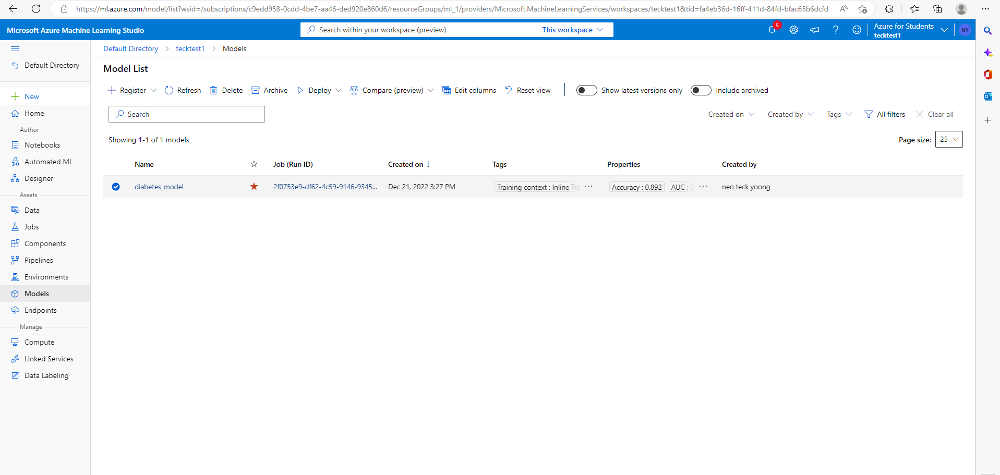
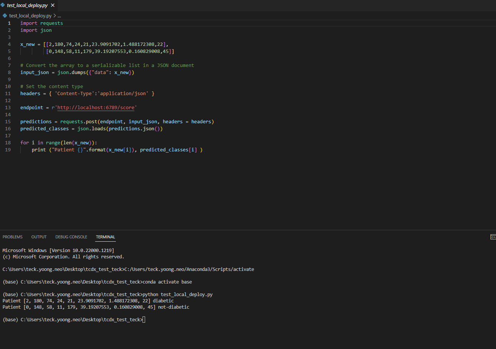
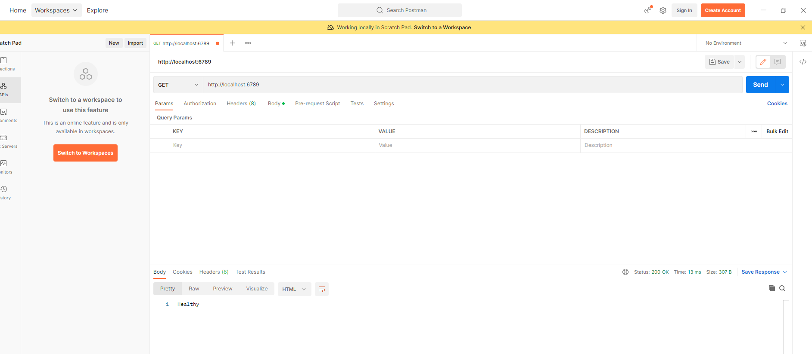
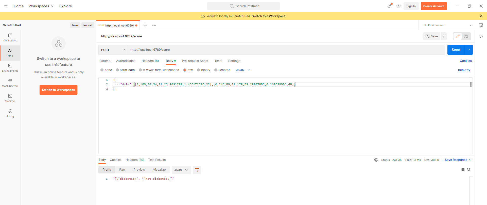

# Deploy into Azure ML locally

## Set up the azure ml studio
- Create Azure accounts
- Create Resource Group under your subscriptions
- Create Resource Azure machine learning in Azure Resource Group

## Preparing the ML scripts
- Requires Inference Script 
- Requires Registered Model in Azure Model

- Requires Deployment Config (In deploy.ipynb script)

## Process of the training and deployment
The whole process of training and deployment is in the deploy.ipynb script. It shows the training process and register the model in azure ml studio. After registering and logging the model, can proceed to deploy the machine learning model locally. 

## Local outputs by python

## Local outputs by postman

